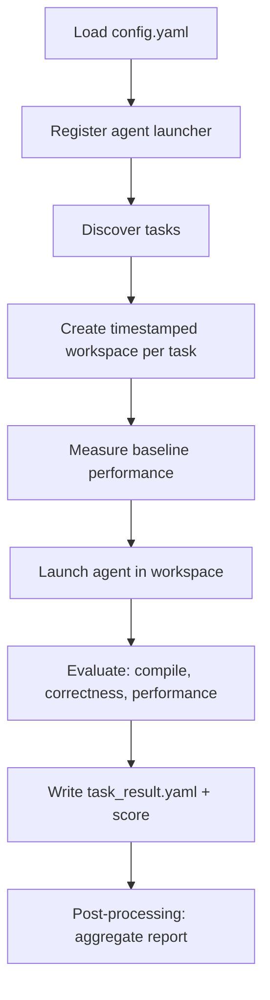

---
myst:
    html_meta:
        "description": "Learn how to configure config.yaml, run an AgentKernelArena evaluation against GPU kernel tasks, resume interrupted runs, and read scored results."
        "keywords": "AgentKernelArena, run evaluation, config.yaml, GPU kernel, ROCm, AMD, task results, resume run, scoring"
---

# Run an evaluation in AgentKernelArena

An evaluation runs one agent against a set of tasks and produces scored results.
This topic explains how to configure a run, execute it, resume an
interrupted run, and read the output.

## Configure `config.yaml`

The root `config.yaml` selects the agent, the tasks, and the target GPU:

```yaml
agent:
  template: cursor          # one agent template per run

tasks:
  - hip2hip/gpumode/GELU
  - triton2triton/vllm/triton_rms_norm
  # - hip2hip                 # all tasks under a category
  # - all                     # every available task

target_gpu_model: MI300
log_directory: logs
workspace_directory_prefix: workspace
```

### Select tasks

Each entry in `tasks` is a path relative to the `tasks/` directory. You can
select tasks at any level of granularity.

| Entry | Selects |
| --- | --- |
| `all` | Every task in `tasks/` |
| `hip2hip` | All tasks under `tasks/hip2hip/` |
| `triton2triton/vllm` | All tasks under that subdirectory |
| `hip2hip/gpumode/GELU` | A single task |

See [Configuration and API reference](../reference/api-reference.md) for the full
set of `config.yaml` fields.

## Start a run

```bash
make docker-run CONFIG=config.yaml
```

Use a non-default config file to keep multiple task sets side-by-side:

```bash
make docker-run CONFIG=config_triton.yaml
```

Add a suffix to label a run directory (useful for A/B testing):

```bash
make docker-run CONFIG=config.yaml RUN_ARGS="--run-suffix cursor_with_mcp"
# → workspace_MI300_cursor/run_20260617_101500_cursor_with_mcp
```

For debugging, enter the exact Docker runtime used by the benchmark:

```bash
make docker-shell
```

The Docker runner currently supports Codex, Claude Code, and Cursor Agent login
reuse from the host. It preflights the selected config before starting the
benchmark run.

## Run across multiple GPUs

Use `make docker-parallel-run` when a server has multiple GPUs and the task set
is large enough to keep them busy. The parallel runner starts one Docker worker
container per GPU, masks each worker to one GPU, and lets workers claim tasks
from a shared queue:

```bash
make docker-parallel-run CONFIG=config.yaml GPU_IDS=0,1,2,3,4,5,6,7
```

If `GPU_IDS` is omitted, the runner discovers GPU IDs with `rocm-smi --showid`:

```bash
make docker-parallel-run CONFIG=config.yaml
```

`RUN_ARGS` works the same way as `docker-run`:

```bash
make docker-parallel-run \
  CONFIG=config.yaml \
  GPU_IDS=0,1 \
  RUN_ARGS="--run-suffix parallel_smoke"
```

Parallel runs support optimization agents and `task_validator`. See
[Run tasks in parallel across multiple GPUs](parallel-run.md) for scheduling,
GPU isolation, resume behavior, and failure handling.

## What happens during a run



For each task, the framework:

1. Copies the task into an isolated, timestamped workspace.
2. Measures a *baseline* (compiles and times the original kernel; for
   `torch2hip` tasks it times the PyTorch reference directly).
3. Launches the configured agent with a generated prompt.
4. Evaluates the agent's kernel for compilation, correctness, and performance.
5. Writes a standardized `task_result.yaml` and computes a score.

After all tasks finish, a post-processing step aggregates the per-task results
into a run report.

## Resume an interrupted run

Long runs can be resumed; completed tasks are skipped.

```bash
# Resume a specific run directory
make docker-run CONFIG=config.yaml RUN_ARGS="--resume-run run_20260617_101500"

# Resume the most recent run
make docker-run CONFIG=config.yaml RUN_ARGS="--resume-latest"
```

For a parallel run, use the same `RUN_ARGS` with `docker-parallel-run`:

```bash
make docker-parallel-run CONFIG=config.yaml GPU_IDS=0,1,2,3 RUN_ARGS="--resume-latest"
```

## Read the results

A run produces this layout under the workspace directory:

```text
workspace_<gpu>_<agent>/
└── run_<timestamp>/
    ├── .parallel/              # present for docker-parallel-run
    │   ├── pending/
    │   ├── running/
    │   ├── done/
    │   └── failed/
    └── <task_name>_<timestamp>/
        ├── task_result.yaml      # per-task result + score
        └── ...                   # agent output, modified kernel, logs
```

Each `task_result.yaml` contains the scored outcome:

```yaml
task_name: hip2hip/gpumode/GELU
pass_compilation: true
pass_correctness: true
base_execution_time: 1.82        # ms
best_optimized_execution_time: 1.15
speedup_ratio: 1.58
optimization_summary: "..."
score: 278.0
```

The `score` combines compilation, correctness, and speedup. See
[Configuration and API reference](../reference/api-reference.md#scoring) for the
scoring formula, and [Visualize and compare runs](visualization.md) to render and
compare reports across agents.
