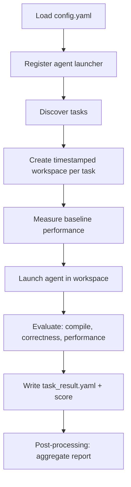

# Run an evaluation

An evaluation runs one agent against a set of tasks and produces scored results.
This page walks through configuring the run, executing it, resuming an
interrupted run, and reading the output.

## 1. Configure `config.yaml`

The root `config.yaml` selects the agent, the tasks, and the target GPU.

```yaml
agent:
  template: cursor          # one agent template per run

tasks:
  - hip2hip/gpumode/GELU
  - triton2triton/vllm/triton_rms_norm
  # - hip2hip                 # all tasks under a category
  # - all                     # every available task

target_gpu_model: MI300
log_directory: logs
workspace_directory_prefix: workspace
```

### Selecting tasks

Each entry in `tasks` is a path relative to the `tasks/` directory. You can
select tasks at any level of granularity:

| Entry | Selects |
| --- | --- |
| `all` | Every task in `tasks/` |
| `hip2hip` | All tasks under `tasks/hip2hip/` |
| `triton2triton/vllm` | All tasks under that subdirectory |
| `hip2hip/gpumode/GELU` | A single task |

See [Configuration and API reference](../reference/api-reference.md) for the full
set of `config.yaml` fields.

## 2. Run

```bash
make docker-run CONFIG=config.yaml
```

Use a non-default config file to keep multiple task sets side-by-side:

```bash
make docker-run CONFIG=config_triton.yaml
```

Add a suffix to label a run directory (useful for A/B testing):

```bash
make docker-run CONFIG=config.yaml RUN_ARGS="--run-suffix cursor_with_mcp"
# → workspace_MI300_cursor/run_20260617_101500_cursor_with_mcp
```

For debugging, enter the exact Docker runtime used by the benchmark:

```bash
make docker-shell
```

The Docker runner currently supports Codex, Claude Code, and Cursor Agent login
reuse from the host. It preflights the selected config before starting the
benchmark run.

## 3. What happens during a run



For each task, the framework:

1. Copies the task into an isolated, timestamped workspace.
2. Measures a **baseline** (compiles and times the original kernel; for
   `torch2hip` tasks it times the PyTorch reference directly).
3. Launches the configured agent with a generated prompt.
4. Evaluates the agent's kernel for compilation, correctness, and performance.
5. Writes a standardized `task_result.yaml` and computes a score.

After all tasks finish, a post-processing step aggregates the per-task results
into a run report.

## 4. Resume an interrupted run

Long runs can be resumed; completed tasks are skipped.

```bash
# Resume a specific run directory
python main.py --resume-run run_20260617_101500

# Resume the most recent run
python main.py --resume-latest
```

## 5. Read the results

A run produces this layout under the workspace directory:

```text
workspace_<gpu>_<agent>/
└── run_<timestamp>/
    └── <task_name>_<timestamp>/
        ├── task_result.yaml      # per-task result + score
        └── ...                   # agent output, modified kernel, logs
```

Each `task_result.yaml` contains the scored outcome:

```yaml
task_name: hip2hip/gpumode/GELU
pass_compilation: true
pass_correctness: true
base_execution_time: 1.82        # ms
best_optimized_execution_time: 1.15
speedup_ratio: 1.58
optimization_summary: "..."
score: 278.0
```

The `score` combines compilation, correctness, and speedup. See
[Configuration and API reference](../reference/api-reference.md#scoring) for the
scoring formula, and [Visualize and compare runs](visualization.md) to render and
compare reports across agents.
